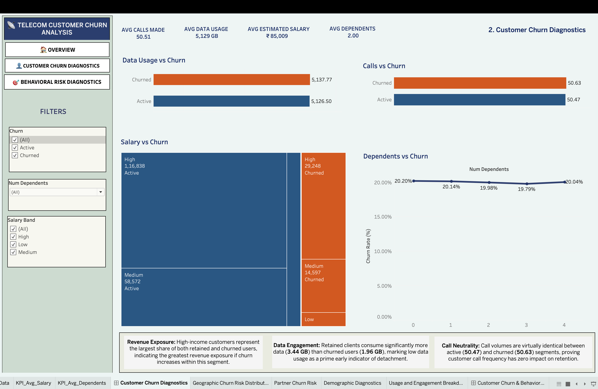
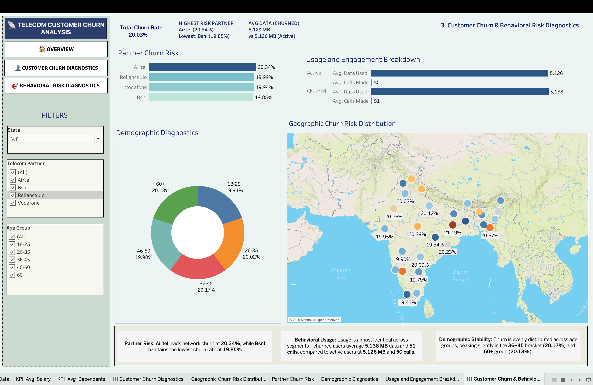

# 📡 Telecom Customer Churn Analysis

## 📖 Project Overview

Customer churn is a direct threat to revenue in the telecom industry, where acquiring a new customer typically costs several times more than retaining an existing one. Without visibility into which customers are likely to leave and why, retention efforts are reactive and poorly targeted.

This project analyzes telecom customer data — usage behavior, demographics, and geography — using **PostgreSQL** for data cleaning and business analysis, and **Tableau** for interactive dashboards, to identify high-risk customer segments and equip stakeholders with data-driven retention strategies.

---

## 🎯 Objectives

**Primary Objective:** Identify the key behavioral and demographic factors driving customer churn, enabling the business to prioritize retention efforts where they matter most.

- Quantify overall churn rate and identify the customer segments with disproportionately high churn.
- Analyze how usage patterns (calls, data consumption) correlate with churn risk.
- Compare churn across telecom partners, geographies, and demographic groups to surface where the problem is concentrated.
- Translate findings into a prioritized, actionable segment list for targeted retention campaigns.
- Deliver interactive Tableau dashboards so stakeholders can monitor churn KPIs on an ongoing basis.

**Business Questions Answered**

1. What is the overall customer churn rate?
2. Which telecom partners have the highest churn rate?
3. Which states experience the highest customer churn?
4. How do customer demographics (age, gender, dependents) influence churn?
5. Does customer usage (calls and data consumption) affect churn?
6. Which customer segments should be prioritized for retention strategies?
7. What insights can help reduce customer churn?

> **Scope note:** City-level churn analysis was excluded. In the source data, city values were not consistently linked to state (only 6 distinct cities across 28 states, with no reliable geographic correspondence), so geographic analysis is presented at the state level only. SMS usage was similarly excluded from the dashboards after initial scoping — the analysis focuses on calls and data consumption as the primary usage signals.

---

## 🛠️ Tools & Technologies

- **PostgreSQL** — data cleaning, exploratory data analysis, business analysis
- **Tableau** — interactive dashboard development and data visualization
- **GitHub** — project documentation and version control

---

## 📊 SQL Analysis

All SQL lives in a single script, `Customer_Churn_Analysis.sql`, organized into seven clearly labeled parts covering five analytical stages:

| Part | Stage |
|---|---|
| Part 1 | Table creation — schema design, data types, constraints |
| Part 2 | Data cleaning — missing value checks, duplicate detection, outlier and business-rule validation |
| Part 3 | Data preprocessing — standardization, null handling, deduplication |
| Part 4 | Exploratory data analysis — customer distribution, churn overview, demographic and usage analysis |
| Part 5 | Basic business analysis — Q1–Q10: churn rate, segment counts, usage comparisons |
| Part 6 | Intermediate business analysis — Q11–Q20: CTEs, subqueries, `HAVING`, `EXISTS`/`NOT EXISTS` |
| Part 7 | Advanced business analysis — Q21–Q30: window functions — `RANK`, `DENSE_RANK`, `ROW_NUMBER`, `LAG`, `NTILE` |

**30 business-driven SQL queries** across three difficulty tiers, covering `GROUP BY`, aggregate functions, `CASE`, CTEs, subqueries, and window functions.

---

## 📈 Tableau Dashboards

**Dashboard 1 — Executive Overview**
KPI summary (total, churned, active customers, overall churn rate), churn by telecom partner, churn by age group, gender split, and a state-level geographic churn map.

**Dashboard 2 — Customer Churn Diagnostics**
Compares usage behavior (calls, data), salary bands, and dependents between churned and retained customers to identify behavioral churn indicators.

**Dashboard 3 — Behavioral & Geographic Risk Diagnostics**
Ranks telecom partners and states by churn rate, breaks down churn by age group, and surfaces combined usage/geographic risk patterns to prioritize retention targets.

---

## 💡 Key Business Insights

- **Overall churn rate: 20.03%** across 2,37,503 customers (47,573 churned, 1,89,930 active) — a meaningful retention challenge for the business.
- **Gender is the strongest demographic signal:** male subscribers account for **59.5% of total churn** (28,286 of 47,573 churned customers), against 40.5% for female subscribers.
- **Age drives churn by volume, not necessarily by rate:** customers aged 46+ make up **over 51% of all churned customers** (24,303 users) — the 46–60 band alone accounts for 12,476 churned customers, the single largest age group by volume. By churn *rate*, however, the 36–45 band peaks slightly higher (20.17%), showing volume and rate tell different parts of the story.
- **Partner performance is close but not flat:** Airtel has the highest churn rate (20.34%), Bsnl the lowest (19.85%) — a real but modest 0.49-point spread across all four partners.
- **Call frequency shows no relationship with churn:** churned and active customers place nearly identical average calls (50.63 vs 50.47), ruling out call volume as a churn predictor.
- **High-income customers represent the largest revenue exposure:** the high salary band has both the largest active base (1,16,838) and the largest churned count (29,248) of any salary segment — meaning retention efforts here protect the most revenue per customer saved.

---

## 🎯 Recommendations

- **Prioritize male subscribers aged 46+ on Airtel** — the highest-risk intersection of the three strongest churn signals identified (gender, age, partner).
- **Do not rely on call-volume-based retention triggers** — call frequency shows no predictive relationship with churn; retention scoring should weight other signals more heavily.
- **Focus retention spend on the high-income segment first** — it carries the largest churned volume of any salary band, so retaining customers here protects disproportionate revenue per successful save.
- **Investigate the 36–45 age band specifically** — it has the highest churn *rate* of any group even though it isn't the largest by volume, suggesting a distinct, underlying cause worth a follow-up analysis.

---

## 🚀 Skills Demonstrated

**SQL:** data cleaning, exploratory data analysis, CTEs, subqueries, window functions (`RANK`, `DENSE_RANK`, `ROW_NUMBER`, `LAG`, `NTILE`), aggregate functions

**Tableau:** interactive dashboards, KPI design, geographic maps, filters, calculated fields, dashboard actions, business storytelling

---

## 📸 Dashboard Preview

### 1. Overview

### 2. Customer Churn Diagnostics

### 3. Behavioral Risk Diagnostics

**Tableau Public:** https://public.tableau.com/app/profile/shibam.mahato/viz/Shibam-TelecomCustomerChurnAnalysis/Overview?publish=yes

---

## 👨‍💻 Author

**Shibam Mahato-**
Data Analyst | Business Analyst | SQL, Excel, Tableau
